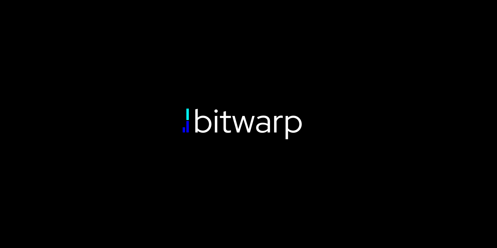

# Welcome to BitWarp Networking

**BitWarp**  - a high-performance, next-generation network library for organizing the operation of real-time applications based on a binary protocol with support for hybrid compression and encryption, written in **TypeScript**.

> **Forget the pain of implementing client-server applications!** **BitWarp** offers a modern, out-of-the-box solution with a user-friendly API for production-ready, real-time applications.

**Have a questions?** [Contact me](mailto:ilya@neurosell.top)

---

**High Performance** · **Binary protocol** · **Automatic Peer Management** · **Reactive** · **Modern**

---

## Table of Contents
- [About library](#about-bitwarp-networking);
- [Installation and Examples](#get-started);
- [Comparison](#network-libraries-comparison);
- [Documentation](#documentation);
- [Roadmap](#roadmap);
- [Licensing](#licensing);

---

## About BitWarp Networking
[WIP]

---

## Get started
### Installation
[WIP]

### Basic example
[WIP]

### Examples
[WIP]

---

## Network libraries comparison
[WIP]

---

## Documentation
[WIP]

---

## Roadmap
[WIP]

---

## Licensing
[WIP]

---
